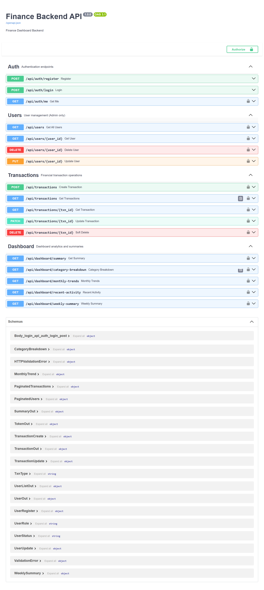
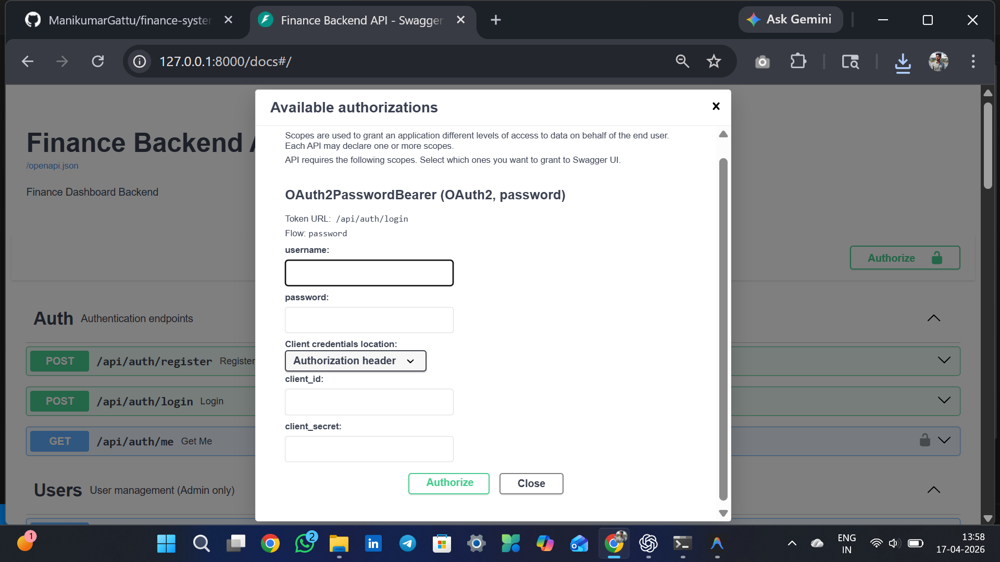

<div align="center">


<br/><br/>

# 💰 Finance Backend API

### A production-ready Python Finance Tracking System
### Built with FastAPI · MySQL · JWT Authentication · Role-Based Access

<br/>

[](https://finance-system-backend-oxup.onrender.com/docs)
[](https://github.com/ManikumarGattu/finance-system-backend)

</div>

---

## 📸 Project Interface




> 🔗 **Live Swagger UI** → [https://finance-system-backend-oxup.onrender.com/docs](https://finance-system-backend-oxup.onrender.com/docs)

The API features a fully interactive **Swagger UI** with 18 endpoints across 4 route groups — Auth, Users, Transactions, and Dashboard — all secured with JWT Bearer token authentication.

---

## 📋 Table of Contents

- [About the Project](#-about-the-project)
- [Tech Stack](#-tech-stack)
- [Features](#-features)
- [Project Structure](#-project-structure)
- [API Endpoints](#-api-endpoints)
- [Database Schema](#-database-schema)
- [Getting Started](#-getting-started)
- [Environment Variables](#-environment-variables)
- [Role Based Access](#-role-based-access)
- [Deployment](#-deployment)
- [Author](#-author)

---

## 🎯 About the Project

This is a **Python-based Finance Tracking System** backend built as an internship assignment for **Zorvyn FinTech Pvt. Ltd.**

The system allows users to manage and analyze financial records including income and expenses, generate financial summaries and analytics, and implement role-based access control for different types of users.

> *"A smaller project with strong fundamentals, clean structure, and correct logic is always valued more than unnecessary complexity."* — Assignment Brief

---

## 🛠️ Tech Stack

| Layer | Technology | Version |
|---|---|---|
| **Language** | Python | 3.11.9 |
| **Framework** | FastAPI | 0.110.0 |
| **ORM** | SQLAlchemy | 2.0.29 |
| **Database** | MySQL | 8.0 |
| **Validation** | Pydantic | 2.6.4 |
| **Auth** | JWT (python-jose) | 3.3.0 |
| **Password Hashing** | Passlib + bcrypt | 1.7.4 |
| **Server** | Uvicorn | 0.29.0 |
| **Deployment** | Render.com | — |

---

## ✨ Features

### 🔐 Authentication & Security
- JWT Bearer Token authentication
- bcrypt password hashing
- Role-based access control (Admin / Analyst / Viewer)
- User status management (Active / Inactive)
- OAuth2 Password Bearer flow

### 💳 Financial Records Management
- Full CRUD operations for transactions
- Income and expense tracking
- Category-based organization
- Date-based filtering
- Soft delete (records preserved, not permanently deleted)
- Pagination for all list endpoints

### 📊 Analytics & Dashboard
- Total income, expenses, and net balance
- Category-wise breakdown
- Monthly income vs expense trends
- Recent activity (last 10 transactions)
- Weekly summary (last 7 days)

### 👥 User Management (Admin Only)
- List all users with pagination
- Update user roles
- Update user status
- Delete users

---

## 📁 Project Structure

```
finance-system-backend/
├── app/
│   ├── __init__.py
│   ├── main.py                  ← FastAPI app entry point
│   ├── database.py              ← MySQL connection via SQLAlchemy
│   ├── dependencies.py          ← JWT auth + role guards
│   │
│   ├── models/
│   │   ├── __init__.py
│   │   ├── user.py              ← User DB model (role + status)
│   │   └── transaction.py       ← Transaction DB model (soft delete)
│   │
│   ├── schemas/
│   │   ├── __init__.py
│   │   ├── user.py              ← Pydantic input/output schemas
│   │   └── transaction.py       ← Transaction + dashboard schemas
│   │
│   ├── services/
│   │   ├── __init__.py
│   │   └── auth_service.py      ← JWT create/decode + bcrypt hashing
│   │
│   └── routes/
│       ├── __init__.py
│       ├── auth.py              ← Register, Login, /me
│       ├── users.py             ← User CRUD + role/status (Admin)
│       ├── transactions.py      ← Transaction CRUD + filters
│       └── dashboard.py         ← 5 analytics endpoints
│
├── .python-version              ← Forces Python 3.11 on Render
├── .gitignore
├── Procfile
├── requirements.txt
└── README.md
```

---

## 🔗 API Endpoints

### 🔐 Auth — Authentication Endpoints
| Method | Endpoint | Access | Description |
|--------|----------|--------|-------------|
| `POST` | `/api/auth/register` | Public | Register a new user |
| `POST` | `/api/auth/login` | Public | Login and get JWT token |
| `GET` | `/api/auth/me` | Any role | Get current user info |

### 👥 Users — User Management (Admin Only)
| Method | Endpoint | Access | Description |
|--------|----------|--------|-------------|
| `GET` | `/api/users` | Admin | Get all users (paginated) |
| `GET` | `/api/users/{id}` | Admin | Get single user by ID |
| `DELETE` | `/api/users/{id}` | Admin | Delete a user |
| `PATCH` | `/api/users/{id}/role` | Admin | Update user role |
| `PATCH` | `/api/users/{id}/status` | Admin | Update user status |

### 💳 Transactions — Financial Operations
| Method | Endpoint | Access | Description |
|--------|----------|--------|-------------|
| `POST` | `/api/transactions` | Admin | Create a new transaction |
| `GET` | `/api/transactions` | Any role | Get all with filters + pagination |
| `GET` | `/api/transactions/{id}` | Any role | Get single transaction |
| `PATCH` | `/api/transactions/{id}` | Admin | Update a transaction |
| `DELETE` | `/api/transactions/{id}` | Admin | Soft delete a transaction |

### 📊 Dashboard — Analytics & Summaries
| Method | Endpoint | Access | Description |
|--------|----------|--------|-------------|
| `GET` | `/api/dashboard/summary` | Any role | Total income, expenses, balance |
| `GET` | `/api/dashboard/category-breakdown` | Any role | Per-category totals |
| `GET` | `/api/dashboard/monthly-trends` | Any role | Monthly income vs expense |
| `GET` | `/api/dashboard/recent-activity` | Any role | Last 10 transactions |
| `GET` | `/api/dashboard/weekly-summary` | Any role | Last 7 days summary |

---

## 🗄️ Database Schema

```sql
-- Users Table
users (
  id            INT PRIMARY KEY AUTO_INCREMENT,
  name          VARCHAR(100) NOT NULL,
  email         VARCHAR(150) UNIQUE NOT NULL,
  password_hash VARCHAR(255) NOT NULL,
  role          ENUM('viewer', 'analyst', 'admin') DEFAULT 'viewer',
  status        ENUM('active', 'inactive') DEFAULT 'active',
  created_at    DATETIME DEFAULT NOW()
)

-- Transactions Table
transactions (
  id         INT PRIMARY KEY AUTO_INCREMENT,
  user_id    INT FOREIGN KEY → users.id,
  amount     FLOAT NOT NULL,
  txn_type   ENUM('income', 'expense') NOT NULL,
  category   VARCHAR(100) NOT NULL,
  txn_date   DATE NOT NULL,
  notes      TEXT,
  is_deleted BOOLEAN DEFAULT FALSE,
  created_at DATETIME DEFAULT NOW()
)
```

---

## 🚀 Getting Started

### Prerequisites
- Python 3.11+
- MySQL 8.0+
- Git

### 1. Clone the Repository
```bash
git clone https://github.com/ManikumarGattu/finance-system-backend.git
cd finance-system-backend
```

### 2. Create Virtual Environment
```bash
python -m venv venv

# Activate — Windows
venv\Scripts\activate

# Activate — Mac/Linux
source venv/bin/activate
```

### 3. Install Dependencies
```bash
pip install -r requirements.txt
```

### 4. Configure Environment Variables
Create a `.env` file in the project root:
```env
DB_HOST=localhost
DB_PORT=3306
DB_USER=root
DB_PASSWORD=your_mysql_password
DB_NAME=finance_db
SECRET_KEY=your_secret_key_here
ALGORITHM=HS256
ACCESS_TOKEN_EXPIRE_MINUTES=60
```

### 5. Create MySQL Database
```sql
CREATE DATABASE finance_db;
```

### 6. Run the Server
```bash
uvicorn app.main:app --reload
```

### 7. Open Swagger UI
```
http://127.0.0.1:8000/docs
```

Tables are **auto-created** on first startup via SQLAlchemy. ✅

---

## 🔑 Environment Variables

| Variable | Description | Example |
|---|---|---|
| `DB_HOST` | MySQL host | `localhost` |
| `DB_PORT` | MySQL port | `3306` |
| `DB_USER` | MySQL username | `root` |
| `DB_PASSWORD` | MySQL password | `yourpassword` |
| `DB_NAME` | Database name | `finance_db` |
| `SECRET_KEY` | JWT signing key | `your_secret_key` |
| `ALGORITHM` | JWT algorithm | `HS256` |
| `ACCESS_TOKEN_EXPIRE_MINUTES` | Token expiry | `60` |

---

## 👥 Role Based Access

| Role | Register | View Records | Filter | Analytics | Create/Edit/Delete | Manage Users |
|---|---|---|---|---|---|---|
| **viewer** | ✅ | ✅ | ❌ | ✅ | ❌ | ❌ |
| **analyst** | ✅ | ✅ | ✅ | ✅ | ❌ | ❌ |
| **admin** | ✅ | ✅ | ✅ | ✅ | ✅ | ✅ |

> **Note:** New users are registered as `viewer` by default. Admin must manually upgrade roles.

---

## ☁️ Deployment

This project is deployed on **Render.com** with a free cloud MySQL database.

### Live URLs
| Resource | URL |
|---|---|
| **API Base** | https://finance-system-backend-oxup.onrender.com |
| **Swagger Docs** | https://finance-system-backend-oxup.onrender.com/docs |
| **Health Check** | https://finance-system-backend-oxup.onrender.com/ |

### Deployment Stack
- **Server:** Render.com (Free Tier)
- **Database:** FreeSQLDatabase.com (Free MySQL)
- **Python:** 3.11.9 (pinned via `.python-version`)

> ⚠️ **Note:** Free tier on Render sleeps after 15 minutes of inactivity. First request may take ~30 seconds to wake up.

---

## 🧪 How to Test

### Using Swagger UI
1. Open [https://finance-system-backend-oxup.onrender.com/docs](https://finance-system-backend-oxup.onrender.com/docs)
2. Register → `POST /api/auth/register`
3. Login → `POST /api/auth/login` → copy token
4. Click **Authorize 🔒** → enter email + password
5. Test any endpoint

### Sample Transaction Payload
```json
{
  "amount": 50000,
  "txn_type": "income",
  "category": "Salary",
  "txn_date": "2026-04-01",
  "notes": "Monthly salary credited"
}
```

---

## 📌 Assumptions Made

- New users default to `viewer` role for security
- Deleted transactions use soft delete (`is_deleted=True`) — data is preserved
- Amount must always be greater than 0
- Transaction date is required (not auto-set to today)
- JWT tokens expire after 60 minutes

---

## 👨‍💻 Author

<div align="center">

**Gattu Mani Kumar**

[](https://github.com/ManikumarGattu)
[](mailto:manikumargattu17@gmail.com)

*Python Developer Enthusiast*

</div>

---

<div align="center">

**⭐ If you found this project helpful, please give it a star!**

*Built with ❤️ using FastAPI + MySQL*

</div>
